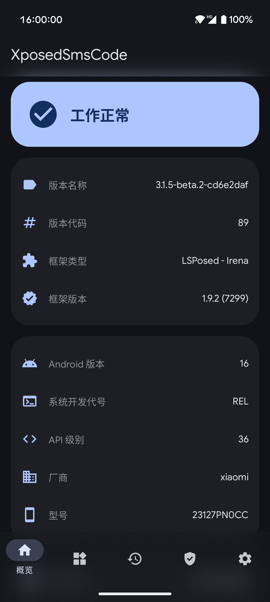
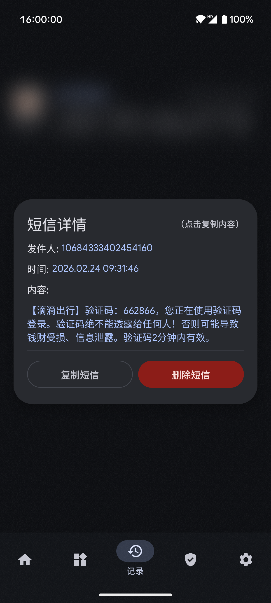

# XposedSmsCode

    
    

       

      

识别短信验证码的Xposed模块，并将验证码拷贝到剪切板，亦可以自动输入验证码。

[English Version](./README-EN.md)

# 应用截图

# 使用
1. Root你的设备，安装Xposed框架；
2. 安装本模块，激活并重启；
3. Enjoy it！

欢迎反馈，欢迎提出意见或建议。

# 注意
- **此模块适用于偏原生的系统，其他第三方定制Rom可能不适用。**
- **兼容性：最低 Android 7.0（API 24），目标 Android 16（API 36）。**
- **支援 LibXposed API 102；不依赖 magisk317 的 GitLab 私有子模块。**
- **使用 `META-INF/xposed/module.prop` 与 `java_init.list`，可在 API 102 框架上直接载入。**
- **代码库：100% Kotlin + Jetpack Compose + Room + Coroutines**
- **遇到问题请先阅读模块中的"常见问题"**

# 功能
- 收到验证码短信后将验证码提取并复制到系统剪贴板
- 收到验证码时显示 Toast 提示
- 收到验证码时显示系统通知
- 将提取过的验证码短信标记为已读（实验性）
- 验证码提取成功后，自动删除该验证码短信（实验性）
- 拦截并屏蔽特定的验证码短信
- 支持自定义验证码短信关键字（支持正则表达式）
- 支持自定义验证码匹配提取规则（支持导入与导出规则表）
- 在支持的应用中自动输入提取的验证码
- 提取并转发应用通知消息中的验证码

# 待实现
- 定时发送短信

# 发布元数据维护
- 发版前校验版本与发布元数据：`scripts/check_release_guard.sh`

# 文档
- [更新日志 (Changelog)](docs/CHANGELOG.md)
- [重构汇总 (Refactoring Summary)](docs/REFACTORING.md)
- [隐私政策 (Privacy Policy)](docs/PRIVACY.md)

# 感谢
- [原始项目 (tianma8023/XposedSmsCode)](https://github.com/tianma8023/XposedSmsCode)
- [Xposed](https://github.com/rovo89/Xposed)
- [NekoSMS](https://github.com/apsun/NekoSMS)
- [Xposed](https://github.com/rovo89/Xposed)
- [NekoSMS](https://github.com/apsun/NekoSMS)
- [Material Dialogs](https://github.com/afollestad/material-dialogs)
- [EventBus](https://github.com/greenrobot/EventBus)
- [Room](https://developer.android.com/training/data-storage/room)
- [Kotlin Serialization](https://github.com/Kotlin/kotlinx.serialization)
- [Kotlin Coroutines](https://github.com/Kotlin/kotlinx.coroutines)
- [Material Design 3](https://m3.material.io/)
- [Jetpack Compose](https://developer.android.com/jetpack/compose)

# 协议
所有的源码均遵循 [GPLv3](https://www.gnu.org/licenses/gpl-3.0.txt) 协议

